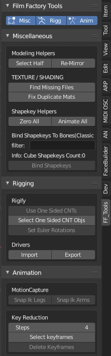

# Table of contents

- [Table of contents](#table-of-contents)
  - [General info](#general-info)
  - [Installation](#installation)
  - [Modeling](#modeling)
  - [Texturing / Shading](#texturing--shading)
  - [Assets](#assets)
  - [Shapekeys](#shapekeys)
  - [Rigging](#rigging)
  - [Animation](#animation)
  - [TODOS](#todos)

## General info

This project is collection of small blender operators, i created for myself while working, compiled as one single addon.

## Installation

Just download src and proceed like any other addon installation.

## Modeling

- select half mesh (using object pivot local x axis)
- re-mirror half, actually delete half and apply mirror

## Texturing / Shading

- Finding Missing Files on Disk.
  - Blender has a function to print file names, but often its hard to find, which object is using that file. This function will help finding / sorting this issue with little help
- Fix Duplicate Materials. Typically on Appending / Merging assets, duplicate materials are created with '.001' etc. this will check those and replace datablocks with orignal material if exists etc

## Assets

- keep meshes selected (unselect rest)
- keep empties selected (unselect rest)
- Create Asset from Empty (Under Heirarchy)
- Create Asset from Mesh (Under Heirarchy)
- Distribute On Line(BoundingBox)
- Distribute In Grid

## Shapekeys

- zero all
- animate frame by frame for testing
- bind to bones (usage workflow steps - classical / old approach)
- this way, atleast, its easier to setup expression while setting pose on rig
  - i.e I have 30 shapekeys ( 10 eyes, 10 brows, 10 lips jaw etc)
  - select mesh(shapekeys obj), plus (shift) select rigify rig
  - goto pose mode, select jaw bone
  - in filter type 'jaw' and hit bind >> all jaw expressions now controller by properties in jaw bone 'N' key area
  - repeat above step for lips etc
  - then select eyes control bone and bind brows and eyes etc

## Rigging

- selected pose bones to use euler rotations
- remove one sided widgets in rigify, less work :)

## Animation

- key selection after n per object
  - very helpful for selecting keyframes

## TODOS

- blendshapes bind to pbones needs little cleanup in UI
- mixamo skeleton to blender rigify meta rig mapping
  - this is so, mixamo rigs can directly converted to rigify rig