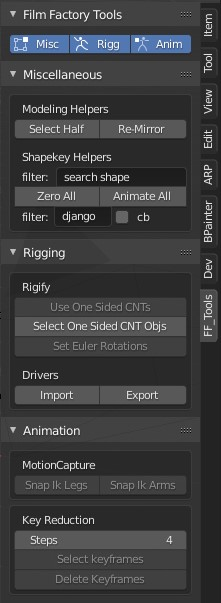

## Table of contents
* [General info](#general-info)
* [Installation](#installation)
* [Modeling](#modeling)
* [Rigging](#rigging)
* [Animation](#animation)

## General info
This project is collection of small blender operators, i created for myself while working, compiled as one single addon.

## Installation
Just download src and proceed like any other addon installation.

## Modeling
- select half mesh (using object pivot local x axis)
- re-mirror half, actually delete half and apply mirror

## Shapekeys
- zero all
- animate frame by frame for testing
- bind to bones (usage workflow steps - classical / old approach)
- this way, atleast, its easier to setup expression while setting pose on rig
    - i.e I have 30 shapekeys ( 10 eyes, 10 brows, 10 lips jaw etc)
    - select mesh(shapekeys obj), plus (shift) select rigify rig
    - goto pose mode, select jaw bone
    - in filter type 'jaw' and hit bind >> all jaw expressions now controller by properties in jaw bone 'N' key area
    - repeat above step for lips etc
    - then select eyes control bone and bind brows and eyes etc
## Rigging
- selected pose bones to use euler rotations
- remove one sided widgets in rigify, less work :)

## Animation

## Todos

## FaceCap To Rigify
- Loader JSON - milestone
    - as is (key / rig) - restore
    - filter drivers ( by key, object ) / print results
    - connect selected tweaking key or object selection etc

# TODOS
- blendshapes bind to pbones needs little cleanup in UI

